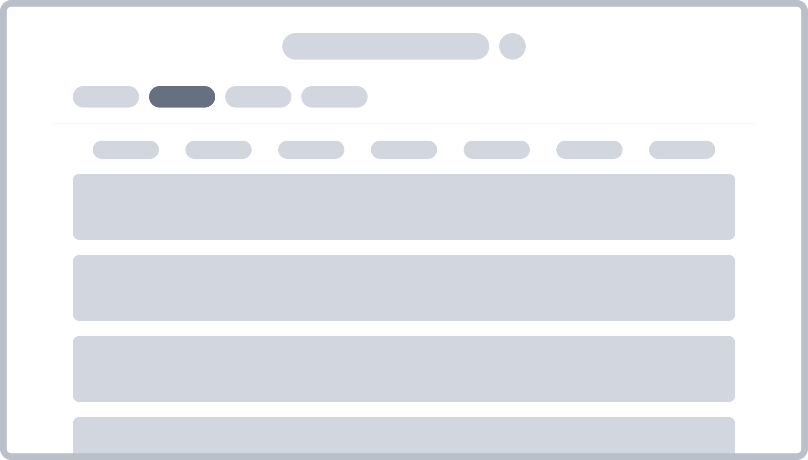
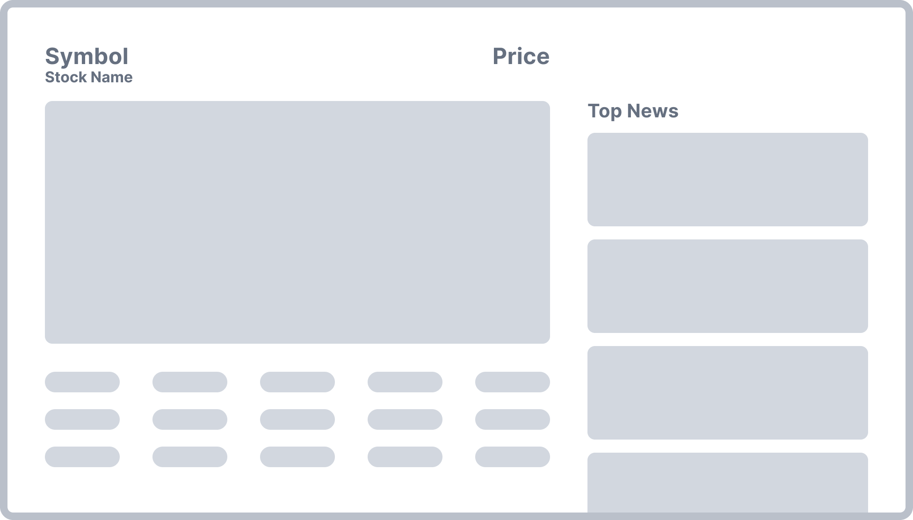

# MarketNews


## Project Description 
Our goal is to build a webpage named 'MarketNews'. It is designed to be simple and easy to use, offering a clear overview of the most important stocks in the current market. We aim to provide an alternative to the more technical pages like [Finviz](https://finviz.com/), by offering a more user-friendly interface. Our focus is on presenting the most important data, leaving the intricate details to the experts. In addition to global market trends, we will integrate news that is specific to companies and stocks. To top it off, we will feature a clean and appealing user interface.

### Project goals
Our page consists of two main pages. The first is a landing page, where we plan to display stocks of the US market. These stocks will be presented in a list of card components, each representing a single stock. On these cards, there will be a quick overview of the stock, including its current price, name, movement in the last day, and a brief graph indicating its current trend.



We will start by featuring 10 stocks initially to showcase the concept and then plan on expanding the page from there. This expansion includes adding all the stocks of the market, as well as implementing search and filtering functions. Depending on how things progress, we also aim to categorize the stocks and add other minor functionalities.

The second page will be accessible when a user clicks on one of the stocks. It will display a detailed view of the selected stock. This page will feature a candlestick chart showing the stock's movement. To complement this chart, we will include additional important metrics about the stock in a table format below, and possibly a pie chart displaying expert indicators. On the right side, there will also be a section for news related to the company that the stock belongs to. A visual representation of this layout can be seen in the picture below.



 If there is time, we will make the candle chart more dynamic, use different timeframes and improve the looks of the UI.

### Data Sources
For the data required in our backend, we will utilize the API provided by [Finnhub](https://finnhub.io), which offers a comprehensive range of data, including news articles.
Finnhub has generously allowed us to use their API endpoint for candle data free of charge, a feature that usually incurs a cost and is reserved for premium users.

### Tasks
- The website should offer a straightforward and comprehensive overview of US stocks. The goal is to present the most important information in an easily accessible format, allowing users to quickly understand the essential data at a glance.
- A distinctive feature of the website will be the integration of detailed stock information alongside relevant news on the same page. This functionality is intended to eliminate the need for users to search for news on other websites.

## Requirements
For the backend to work, ensure you have the axios library installed, as it is crucial for connecting to the API. It can be installed using this command:
```bash
npm install axios
```

In the frontend of our application, we utilize two charting libraries to enhance data visualization:
```bash
npm install react-chartjs-2 chart.js
npm install react-apexcharts apexcharts
```

## How to Run
Once all the required packages have been installed, the website is ready for use. It can be launched with the following command:
```bash
npm run dev
```

The data may take a few seconds to fully update from the API. If you encounter any data that appears outdated, simply refresh the page.

Open the webbrowser on http://localhost:5173/ , please use Google-Chrome for this, since everything was developed and tested on it. It should work for other broweser, but there may be some CSS bugs.

The deployment is currently not working (although it passes all pipelines) The Application is made for laptop users, but as shown in the videos, it is scalable to some bit. 

Inside the `server/constants.ts` file, there are two important constants: `UPDATES_ENABLED` and `DEBUG_MODE`, both initially set to true by default. The `UPDATES_ENABLED` constant determines whether the server data should be periodically refreshed with information from the API. If `DEBUG_MODE` is set to true, the server will displays these updates by outputting each update event to the console.

You can personalize the displayed stocks by modifying the `server/data/stocks.json` file. If updates are enabled, altering the topStocks list – either by adding, editing, or deleting stock symbols – will update the stock overview on the landing page. Additionally, new stock data will be retrieved from the API corresponding to these changes.
Please be aware that the API restricts us to a maximum of 60 calls per minute. Retrieving complete information for each stock, including the current price, metrics, candle data, and more, needs several API calls. Therefore, adding more stocks could result in outdated stock data or, in some cases, failure to load any data at all.


### Local Development

Only change files inside the `src` directory.

**Client side**

All client side files are located in the `src/client` directory.

**Server side**

All server side files are located in the `src/server` directory.

### Local Testing

**run container for local testing**

```bash
docker build -t my-webapp .

docker run -it --rm -p 5173:5173 my-webapp
```
Open a browser and connect to http://localhost:5173

**run bash in interactive container**
```bash
docker build -t my-webapp src/.

docker run -it --rm -p 5173:5173 my-webapp bash
```


